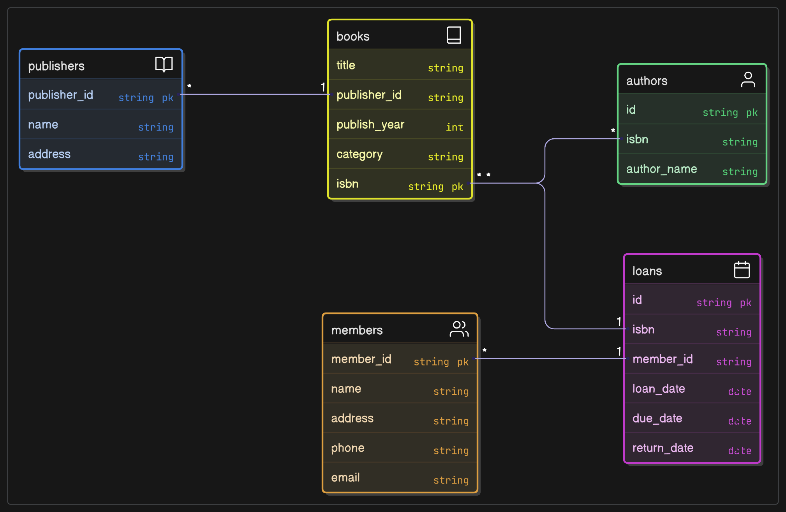

# Lab-05_1

## 1. 問題識別與函數相依性
資料分析與異常問題
初步提供的資料包含書籍、會員和借閱記錄，初步結構未經正規化，可能導致以下問題：

資料重複：
- 書籍：ISBN、書名、作者、出版社名稱、出版社地址、出版年份、書籍類別若儲存在單一表格中，每次借閱同一本書時，這些資訊會重複記錄。
- 會員：會員卡號、會員姓名、地址、電話、Email 若與借閱記錄
- 混雜，每次借閱會重複記錄會員資訊。
- 借閱：會員姓名和書名與會員卡號和 ISBN 重複，可能導致不一致。

插入異常：
- 無法新增尚未被借閱的書籍或未借書的會員，因為借閱記錄需要同時包含書籍和會員資訊。

更新異常：
- 更新某本書的出版社地址或會員的電話，需修改所有相關的借閱記錄，可能導致遺漏或不一致。

刪除異常：
- 刪除某筆借閱記錄可能導致書籍或會員資訊一併被刪除，例如某本書未被借閱時無法保留其資料。

### 1-1.函數相依性列表

- ISBN → 書名, 作者, 出版社名稱, 出版社地址, 出版年份, 書籍類別
- ISBN 唯一決定書籍的屬性
- 會員卡號 → 會員姓名, 會員地址, 會員電話, 會員Email
- 會員卡號唯一決定會員的屬性
- ISBN, 會員卡號, 借閱日期 → 應還日期, 實際歸還日期
- 借閱記錄由 ISBN、會員卡號和借閱日期共同決定
- ISBN → 書名:書名由 ISBN 決定
- 會員卡號 → 會員姓名:會員姓名由會員卡號決定

## 2.最終的 ERD

## 3.正規化設計

### 第一正規化 (1NF)
    要求：所有屬性值必須是原子值，無多值屬性或重複群組。
    問題：作者 (Author) 可能為多位，屬於多值屬性。
    解決：將作者拆分為獨立表格，建立書籍與作者之間的多對多關係。
結果：
- 表格 1：Books (ISBN, 書名, 出版社名稱, 出版社地址, 出版年份, 書籍類別)
- 表格 2：Authors (ISBN, 作者)
- 表格 3：Members (會員卡號, 會員姓名, 會員地址, 會員電話, 會員Email)
- 表格 4：Loans (ISBN, 會員卡號, 借閱日期, 應還日期, 實際歸還日期, 書名, 會員姓名)
### 第二正規化 (2NF)
    要求：消除部分函數相依性，確保非鍵屬性完全依賴於主鍵。
    問題：在 Loans 表格中，主鍵為 (ISBN, 會員卡號, 借閱日期)，但：
    書名依賴於 ISBN（部分鍵）。
    會員姓名依賴於會員卡號（部分鍵）。
    解決：移除書名和會員姓名，因為它們可由 Books 和 Members 表格取得。
結果：
- 表格 1：Books (ISBN, 書名, 出版社名稱, 出版社地址, 出版年份, 書籍類別)
- 表格 2：Authors (ISBN, 作者)
- 表格 3：Members (會員卡號, 會員姓名, 會員地址, 會員電話, 會員Email)
- 表格 4：Loans (ISBN, 會員卡號, 借閱日期, 應還日期, 實際歸還日期)

### 第三正規化 (3NF)
    要求：消除遞移相依性，確保非鍵屬性不依賴於其他非鍵屬性。
    檢查：
    Books 表格：出版社名稱、出版社地址可能存在遞移相依性（假設多本書來自同一出版社，重複記錄出版社資訊）。
    解決：將出版社資訊拆分為獨立表格。
結果：
- 表格 1：Publishers (出版社ID, 出版社名稱, 出版社地址)
- 表格 2：Books (ISBN, 書名, 出版社ID, 出版年份, 書籍類別)
- 表格 3：Authors (ISBN, 作者)
- 表格 4：Members (會員卡號, 會員姓名, 會員地址, 會員電話, 會員Email)
- 表格 5：Loans (ISBN, 會員卡號, 借閱日期, 應還日期, 實際歸還日期)
### BCNF 檢查
    要求：每個函數相依性的決定因素必須是候選鍵。
    檢查：
    Publishers：出版社ID → 出版社名稱, 出版社地址（滿足，出版社ID 是主鍵）。
- Books：ISBN → 書名, 出版社ID, 出版年份, 書籍類別（滿足，ISBN 是主鍵）。
- Authors：(ISBN, 作者) 是主鍵，無其他函數相依性。
- Members：會員卡號 → 會員姓名, 會員地址, 會員電話, 會員
- Email（滿足，會員卡號是主鍵）。
- Loans：(ISBN, 會員卡號, 借閱日期) → 應還日期, 實際歸還日期（滿足，主鍵決定所有屬性）。