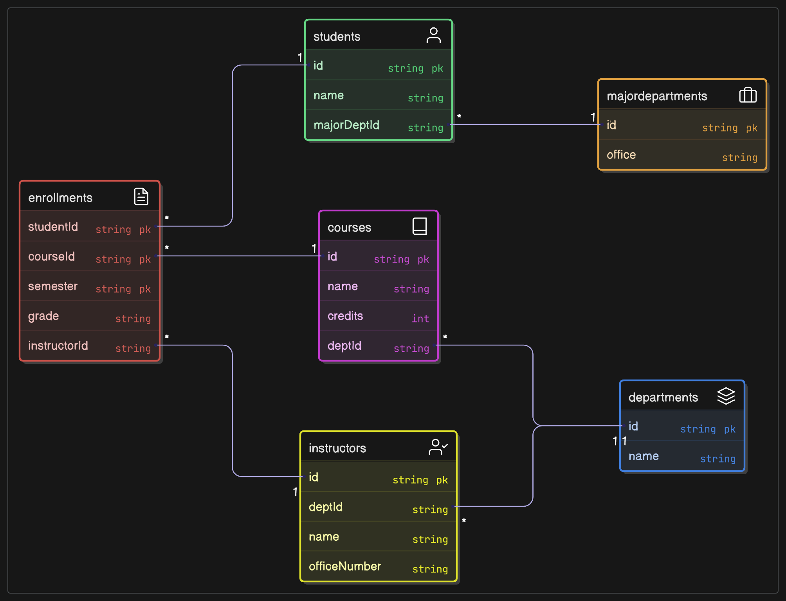

# Lab-05_3

## 1.函數相依性列表

學生 (Student):

- StudentID → StudentName, MajorDeptName, MajorDeptOffice
- MajorDeptName → MajorDeptOffice

課程 (Course):

- CourseCode → CourseName, Credits, DeptCode, DeptName
- DeptCode → DeptName

講師 (Instructor):

- InstructorID → InstructorName, DeptCode, DeptName, OfficeNumber
- DeptCode → DeptName
  
選課記錄 (Enrollment):

- StudentID, CourseCode, Semester → InstructorID, Grade
- StudentID → StudentName
- CourseCode → CourseName
- InstructorID → InstructorName
  
系所 (Department) (從課程和講師分解而來):

- DeptCode → DeptName

## 2.最終的 ERD

## 3.設計原則與說明

### 正規化原則

1. 資料庫正規化至BCNF，確保每個非平凡函數相依性的決定因素（determinant）是超鍵，消除插入、更新和刪除異常。
將DeptCode → DeptName從課程和講師關係中分解，合併為單一系所關係，避免冗餘。
2. 選課記錄移除衍生屬性（StudentName, CourseName, InstructorName），通過外鍵聯結從其他關係取得，減少資料重複。
3. MajorDeptName → MajorDeptOffice分解為獨立的主修科系關係，確保BCNF並支持學生主修的科系辦公室資訊。

### BCNF vs. 3NF考量

1. BCNF分解無損且保留所有函數相依性，適合大學課程註冊系統的資料完整性需求。

2. 若頻繁聯結（如系所與課程/講師）導致效能問題，可考慮退回3NF，將DeptName保留在課程和講師關係中，犧牲部分正規化以換取查詢效率。但由於現代DBMS聯結效能良好，且資料量通常不大，BCNF是更佳選擇。

### ERD設計原則

1. 實體和屬性清晰分離，主鍵和外鍵明確標記，確保資料庫結構易於理解。
2. 使用標準ERD符號（矩形、橢圓、連線）以符合資料庫設計慣例。
3. 選課記錄作為關聯實體，捕捉學生、課程、講師的多對多關係，學期屬性確保歷史選課記錄的唯一性。
4. 假設主修科系名稱（MajorDeptName）與系所代碼（DeptCode）為不同識別方式，因此分為兩個實體。若實際應用中它們相同，可進一步合併

### 效能與實際應用考量

1. 建議在選課記錄的StudentID, CourseCode, Semester, InstructorID上建立索引，以加速查詢（如學生選課歷史或課程報表）。
2. 避免反正規化（如保留DeptName在課程或講師中），優先資料一致性而非微小的查詢效能提升。
3. 學期屬性允許記錄學生在不同學期重修課程的歷史資料，增強系統靈活性
